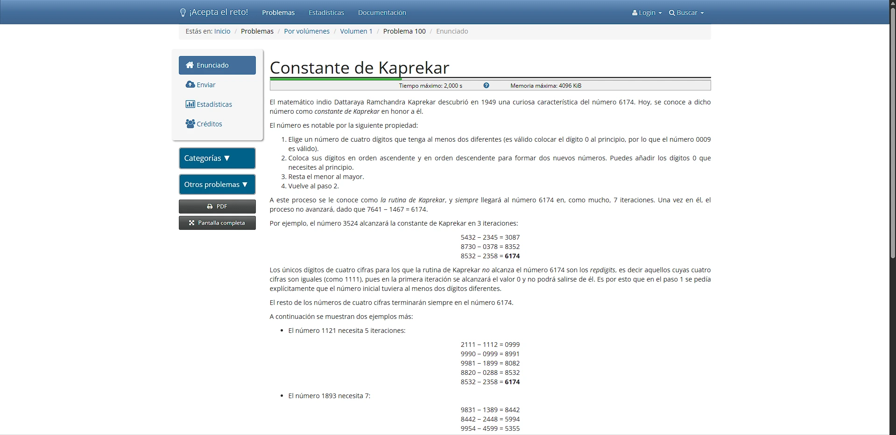

# AeRForU Website


Sitio web de **AeRForU**, extensión para [Acepta el Reto](https://aceptaelreto.com).

🔗 **[aerforu.netlify.app](https://aerforu.netlify.app/)** | 📦 **[Repositorio AeRForU](https://github.com/Jaimepas77/AeRForU)**

---

## Sobre el Proyecto

Landing page para la extensión AeRForU que añade funcionalidades a Acepta el Reto:

- Niveles de dificultad de problemas
- Marcado visual AC/WA
- Categorías y problemas similares
- Estadísticas detalladas
- Descarga de código fuente

---

## Capturas de Pantalla

<div align="center">


*Vista de problema con categorías*


*Panel de estadísticas*


*Lista de problemas con marcado AC/WA*

</div>

---

## Stack Tecnológico

- HTML5 + CSS3 + JavaScript ES6+
- Arquitectura modular con ES Modules
- Diseño responsive
- Tema claro/oscuro
- Google Analytics 4

---

## Instalación Local
```bash
# Clonar repositorio
git clone https://github.com/TuUsuario/aeroforu-website.git
cd aeroforu-website

# Iniciar servidor local
python -m http.server 8000
# o
npx http-server -p 8000

# Abrir en navegador
http://localhost:8000
```

---

## Estructura del Proyecto
```
aeroforu-website/
├── index.html
├── assets/
│   ├── css/              # Estilos modulares
│   ├── js/               # JavaScript ES6 modules
│   ├── images/           # Imágenes optimizadas
│   │   └── screenshots/  # Capturas de pantalla
│   └── data/             # Datos JSON
├── config/
│   └── seo.json          # Configuración SEO
├── sitemap.xml
└── robots.txt
```

---

## Configuración

### Modificar Contenido

Edita los archivos JSON en `/assets/data/`:

- `features.json` - Funcionalidades
- `screenshots.json` - Galería de capturas
- `installation.json` - Pasos de instalación

### Cambiar Tema

Variables CSS en `/assets/css/variables.css`:
```css
:root {
  --primary: #667eea;
  --secondary: #764ba2;
  --accent: #f093fb;
}
```

---

## Autor de la extensión AeRForU

**Jaime Pastrana García**

- GitHub: [@Jaimepas77](https://github.com/Jaimepas77)
- Extensión: [AeRForU](https://github.com/Jaimepas77/AeRForU)
